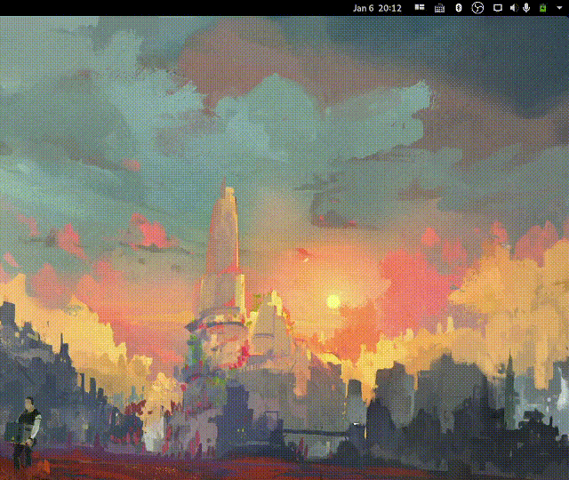

# Spotify DJs

This is an MPRIS Player wrapper around the Spotify Web APIs.



Designed mostly to be used with [librespot](https://github.com/librespot-org/librespot). To have integration with
`playerctl` and `gnome-shell`.

## Setup

### Build and link

```sh
npm install
npm run build
npm link
```

### Create application

1. Go to [Spotify Developer Dashboard](https://developer.spotify.com/dashboard/applications) and create a new app.
2. Add the desired callback uri in the app (with the desired port)
3. Copy the Client ID and Client Secret into the spotdjs.conf
4. Set up the port number and redirect url
5. Copy the `spotdjs.conf` to `~/.config/spotdjs/spotdjs.conf`

### Set librespot callback

When running librespot, configure it to call the callback script:

```sh
librespot --onevent "~/GitHub/spotdjs/librespothandler.sh" # other options...
```

